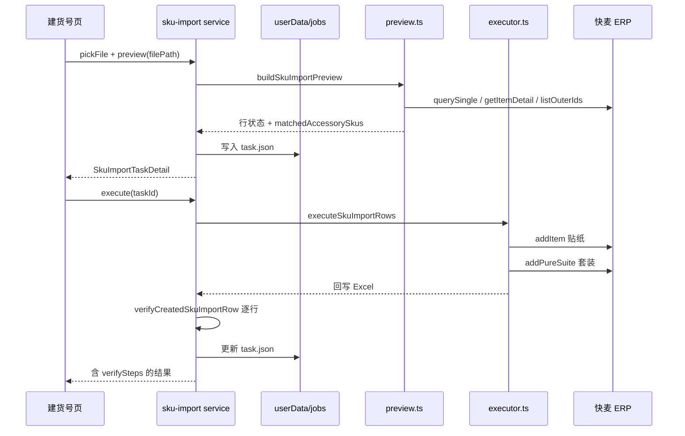

# 建货号桌面应用集成设计

**日期：** 2026-06-28  
**状态：** 待评审  
**背景：** 冒烟 CLI 已跑通 `/item/add`（贴纸）+ `/item/addPureSuite`（套装）全链路；本设计将 validated 流程对齐到 Electron 建货号页，并增量增强 UI。

---

## 1. 已确认决策

| # | 议题 | 决策 |
|---|------|------|
| 1 | 配件未完全匹配 | **硬阻断**：`preview_blocked`，不可执行 |
| 2 | 任务存储 | **落盘** `userData/jobs/sku-import/<task-id>.json` |
| 3 | 执行后验证 | **自动 D2**：每行成功后 `verifyCreatedSkuImportRow` |
| 4 | 多规格配件 | **自动选定 + 预演只读展示** SKU 编码 |
| 5 | UI 改动 | **增量增强**，保留任务列表 + 详情布局 |

---

## 2. 目标与非目标

### 目标

- 桌面端与冒烟脚本使用同一套 `preview` / `executor` / `erp-catalog` 语义。
- 预演信息足够让运营确认：货号、贴纸、配件规格、分类、创建方式后再执行。
- 任务重启可恢复；执行后有 D2 验证结果可查阅。
- 修复 UI 展示错误（贴纸货号规则）。

### 非目标（本版不做）

- 预演阶段手动改配件规格（下拉选择 SKU）。
- 分步向导式 UI 重构。
- `updatePureSuite` 编辑能力或 ERP 内改套件。
- 实时逐行进度 IPC 推送（可后续加 `creating_sticker` 等状态）。

---

## 3. 端到端流程



### 单行预演状态机

```
validateImportRow 失败 → preview_blocked
配件 missing > 0      → preview_blocked  （新增硬规则）
套装货号已存在        → skipped_existing
否则                  → pending（可含 sticker 复用提示）
```

### 单行执行流程（与冒烟一致）

1. 上传白底图 OSS（若有嵌入图）
2. `createSticker` → `/item/add`（`unit: 张`，分类贴纸）
3. 解析配件 + 贴纸 → `itemSuiteBridgeList`
4. `createPureSuite` → `/item/addPureSuite`（分类家居清洗类（组合装），自动计算 flags）
5. Excel 回写「商品SKU货号 / 创建状态 / 失败原因」
6. D2 验证 → 写入 `executeResult.rows[].verifySteps`

---

## 4. 后端改动

### 4.1 `preview.ts`

**新增：配件规格解析**

- 预演匹配配件后，对每条 `matchedAccessoryCodes` 调用 `catalog.buildBridgeEntryForOuterId`（或等价 helper）。
- 扩展 `SkuImportPreviewRow`：

```ts
interface MatchedAccessorySku {
  name: string;           // Excel 配件名（自粘袋）
  itemOuterId: string;    // PJ-ZND01
  skuOuterId: string;     // PJ-ZND01-02（bridge 实际编码）
  sysItemId?: number;
}

// SkuImportPreviewRow 新增字段
matchedAccessorySkus: MatchedAccessorySku[];
stickerOuterId: string;   // buildStickerOuterId(proposedSkuCode)
bundleCategory: string;   // 家居清洗类（组合装）
stickerCategory: string;  // 贴纸
createMethods: { sticker: 'item/add'; bundle: 'item/addPureSuite' };
```

**硬阻断规则**

```ts
if (accessoryMatch.missing.length > 0) {
  status = 'preview_blocked';
  blockedReason = `未匹配配件: ${missing.join('、')}`;
}
```

- 移除「pending + 黄字警告仍可执行」路径。

### 4.2 `main/services/sku-import.ts` → 任务落盘

**路径：** `{userData}/jobs/sku-import/<uuid>.json`

**Schema（`schemaVersion: 1`）：**

```json
{
  "schemaVersion": 1,
  "updatedAt": "ISO8601",
  "data": {
    "id": "uuid",
    "filePath": "/abs/path/上品记录.xlsx",
    "parsed": { "sheetName", "headers", "rows" /* 无 workbookBuffer */ },
    "preview": { /* SkuImportPreviewResult */ },
    "status": "previewed|executing|completed|failed",
    "createdAt": "",
    "updatedAt": "",
    "executeResult": {},
    "failureMessage": ""
  }
}
```

**说明：**

- `workbookBuffer` 不落盘；执行/回写时从 `filePath` 重新读取。
- 嵌入图片：parsed.rows 仅存 `hasImage` + 执行时再从 xlsx 解析 buffer（与现逻辑一致）。
- 启动时 `loadAllTasks()` 扫描目录填充内存索引；CRUD 同步写盘（原子写：tmp + rename）。
- 新增 `main/services/sku-import-jobs.ts` 专职 IO，避免 `sku-import.ts` 膨胀。

### 4.3 执行 + D2 验证

在 `executeSkuImportTask` 成功创建每行后：

```ts
const verification = await verifyCreatedSkuImportRow(catalog, client, previewRow);
// 写入 executeResult.rows[].verifySteps / verifyOk
```

- `verifyOk === false` 时：行 `status` 仍为 `succeeded`（ERP 已创建），但 `failureReason` 或独立字段标记「创建成功，结构验证未通过」。
- 任务级 `failureMessage`：任一 verify 失败时汇总提示。

### 4.4 共享层

| 文件 | 变更 |
|------|------|
| `shared/types/sku-import.ts` | 扩展 PreviewRow、ExecuteRowResult |
| `shared/ipc-channels.ts` | 无新增通道（复用现有 execute/get） |
| `tools/sku-import/erp-catalog.ts` | 无 API 变更；preview 复用 `buildBridgeEntryForOuterId` |

---

## 5. 前端改动（增量）

### 5.1 预演表格列调整

| 列 | 内容 |
|----|------|
| 行号 | 不变 |
| 产品 | 品牌 · 产品名 · 容量 |
| 货号 | 套装 `proposedSkuCode`；贴纸 `stickerOuterId` |
| 套装 / 配件 | 套装标题；配件：`名称 → skuOuterId` 列表 |
| 分类 | 贴纸「贴纸」；套装「家居清洗类（组合装）」 |
| 状态 | pending / blocked / skipped |

- 删除错误文案 `` `{proposedSkuCode}-ST` ``，改用 `row.stickerOuterId`。
- 顶部 Alert 补充一句：「贴纸经 `/item/add` 创建，套装经 `/item/addPureSuite` 创建」。

### 5.2 执行结果区

- 保留成功/失败/跳过计数。
- 每行可展开 **D2 验证步骤**（与冒烟 `[5/6]` 同款 label/detail）。
- verify 失败行：Badge「验证未通过」+ 逐步红色说明。

### 5.3 任务列表

- 增加小图标/文案：已完成且 verify 全过 vs 有 verify 失败。
- 重启应用后列表从磁盘加载（无 UI 变化，行为变化）。

---

## 6. 错误处理

| 场景 | 行为 |
|------|------|
| ERP 会话失效 | preview/execute 抛错；任务 `failed` + failureMessage |
| 配件含规格但未解析到 SKU | preview_blocked |
| 贴纸已存在、套装不存在 | pending；执行复用贴纸 |
| 套装已存在 | skipped_existing |
| 创建成功、D2 失败 | succeeded + verifyOk false；提示人工 ERP 检查 |
| Excel 被外部占用 | execute 失败；任务 failed；不写回 |

---

## 7. 测试计划

| 层级 | 内容 |
|------|------|
| 单测 | preview 硬阻断 missing 配件；matchedAccessorySkus 解析；job 读写 roundtrip |
| 已有 | executor / payload / verify 测试保持绿 |
| 手动 | 导入 `tests/上品测试/上品记录.xlsx` → 预演 → 执行 → 核对 UI 与 ERP |
| 冒烟 | `pnpm run smoke:sku` 仍作为 CI 回归 |

---

## 8. 实施顺序（供 writing-plans 拆分）

1. **类型扩展** — `shared/types/sku-import.ts`
2. **preview 硬阻断 + 配件 SKU 解析** — `preview.ts` + 单测
3. **任务落盘** — `sku-import-jobs.ts` + 改造 `sku-import.ts`
4. **执行后 D2** — `sku-import.ts` execute 路径
5. **UI 增量** — `sku-import.tsx`
6. **验证** — typecheck + test + 手动 Excel 流程

---

## 9. 风险与缓解

| 风险 | 缓解 |
|------|------|
| 预演多调 ERP（每配件 getItemDetail） | 可接受；后续加缓存 |
| job 文件与 Excel 路径不一致 | job 存绝对路径；文件缺失时任务标为 failed |
| parsed 落盘体积 | 不存 workbookBuffer；仅存行 values |

---

## Spec 自检

- [x] 无 TBD / 占位符
- [x] 与已确认五项决策一致
- [x] 架构与 AGENTS.md（jobs 目录、IPC 分层）一致
- [x] 范围可在一个 implementation plan 内完成
